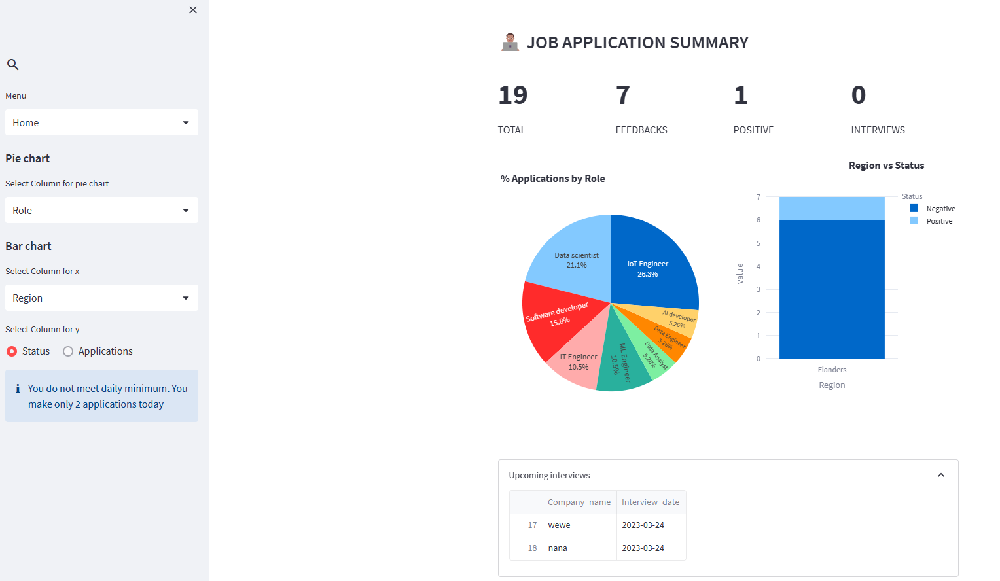
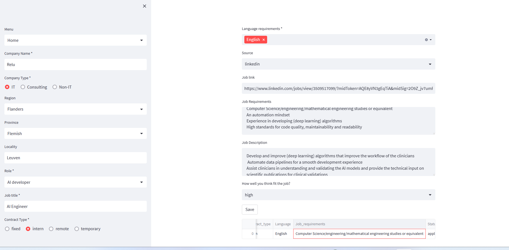
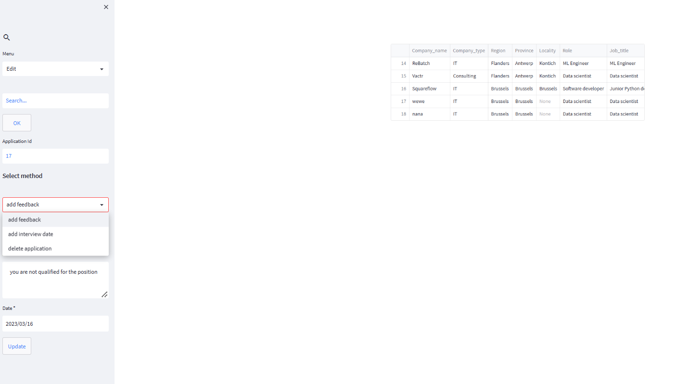

# job-application-organizer

This  app is developed for job appplicant to organize their job application processes.
It is especially designed for IT Professionals, who reside in Belgium. Other users can customize
the app to meet your needs, probably you need to change the Regions, provinces, Roles variables
in the app.py file.





### Deployment

For this version of the app, users can either fork and launch in streamlit cloud or clone it 
and use it locally by creating virtual enviroment and installing the necessary libraries. 
An approach for both methods is mentioned in this document.

For the coming version, I am going to  include user management tools that user can login with 
their credential and use the app from the cloud with out forking or cloning to their machines.

#### 1. Deploying to the cloud

You can fork this repo and deploy your forked repo on [streamlit cloud ](https://streamlit.io/cloud)

Deployment steps
1. created an account in streamlit cloud
2. sign in to your streamlit cloud account
3. create new app
4. add your forked repo name to it and ready to go

Below try the  app I deployed on streamlit cloud.
 [Job application organizer app](https://amanuelzeredawit-job-application-organizer-app-luy270.streamlit.app/)


#### 2. Deploying locally

To deploy locally first you have to clone it your machine, then create virtual environment and install libraries.


0. open cmd and clone the repo

```bash
git clone https://github.com/AmanuelZeredawit/job-application-organizer.git
```

1. Install virtualenv

```bash
pip install virtualenv
```

2. Create a virtual environment and activate it

```bash
virtualenv venv
> On windows -> venv\Scripts\activate
> On Linux -> . env/bin/activate

```

3. Install the necessary libraries

```bash
pip install -r requirements.txt

```

4. Run app.py

```bash
streamlit run app.py

```


### Usage

1. when you open the app for the first time a new csv file(applications.csv) will be created for you.
then you have to go to the "Register" section in the menu bar. and fill the fields for the job application.
for fields like 'Company name" you have to fill mondatory others you can leave it blank, if you don't think
are necessary.





2. May be you have feedback from the recruiter regarding the application , so you need to update your application.
   To edit your application first go to the "Edit" menu and type a keyword of the company on the search bar and 
   press ok. If you have job application with the entered keyword then you will see it in the workspace, otherwise
   you will get an alert message that you did not apply to company with the entered keyword. And use the company Id 
   for the next steps.

   You can choose either "add feedback" or "add interview_date" or "delete application"

* "add feedback" you can add the status ["positive", "negative", "waiting"] and write the detail of the feedback
 you get from the recruiter.
* "add interview date" you can add an interview date for an application
* "delete application" you can delete a job application from the file
  for all the three methods you should put the company Id in the field bar otherwise you will get an alerbox





3. In the home menu you can see a dashboard showing the summary of your application. the parameters of the plot are customizable. 

   An info section is added in the navigation bar showing the job applications you made for that day. if you don't reach
   the minimum different message will be appeared. to set the daily minimum application, got to line 37 on app.py and change the
   variable daily_minimum to the value you want. At the bottom you can see the upcoming interview you have.


### Future development

* To add user management tool
* To add Job companies in the country
* To add web scraper that collects job oppening regularly
* To improve the user interface and put it in production environement


© 2023 Becode, Ghent.


