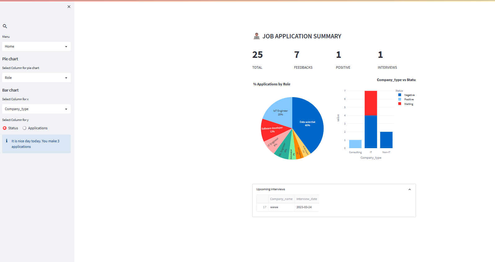

# job-application-organizer

This is app is developed for job appplicant to organize their job application processes.
* In the register section, the user has to fill the job detail.
* In the edit section, the user can either update an application with the response he get from the employees 
  or add interview date. User can even delete an application. 
* In the Home section, the user will get report of his job activities, and various customized visualization tools also included.
  The user is also gets notifications on the number of applications he/she made.




### Deployment

The application is deployed with streamlit locally.

1. Install virtualenv

```bash
pip install virtualenv
```

2. Create a virtual environment and activate it

```bash
virtualenv venv
> On windows -> venv\Scripts\activate
> On Linux -> . env/bin/activate

```

3. Install the necessary libraries

```bash
pip install -r requirements.txt

```

4. Run app.py

```bash
streamlit run app.py

```


